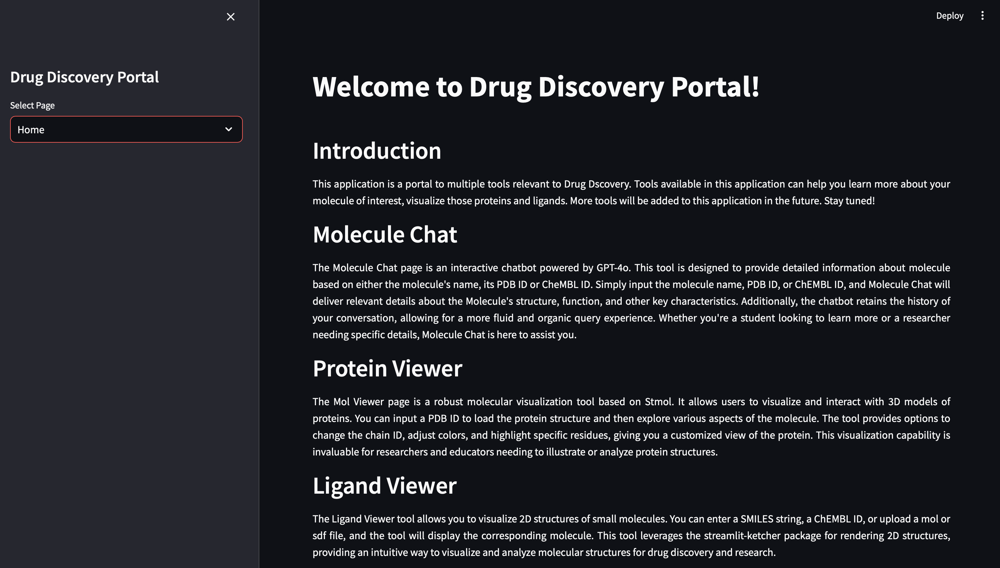

# Drug Discovery Portal: A Streamlit Web Application for Protein and Ligand Visualization



## Introduction

Drug discovery portal is a collection of web applications that can come handy during computational drug design process. This application is built in Streamlit and anyone can use it to chat with GPT-4o model about the protein of their choice, visualize the proteins, and small molecule ligands. Individual tools are developed in modules making it easier for users to run them individually or collectively as a single application. It contains three tools:

**Protein Chat:** Protein chat is a chatbot built using the OpenAI API. This tool offers responses to users' queries regarding their protein of interest and uses the information from UniProt database to do so.

**Protein Viewer:** Protein viewer tool is a visualization tool built using streamlit-molstar library. It uses the famous open source molstar library to build a streamlit based web application. Users can input either the PDB ID or upload a PDB to visualize the structures. Within the tool, users are free to modify the representations for better visualization. 

**Ligand Viewer:** Ligand Viewer tool allows you to visualize 2D structures of small molecules. You can enter a SMILES string, a ChEMBL ID, or upload a mol or sdf file, and the tool will display the corresponding molecule. This tool leverages the streamlit-ketcher package for rendering 2D structures, providing an intuitive way to visualize and analyze molecular structures for drug discovery and research.

### Pre-requisites:

### Downloading the Repository:
Clone the repository from GitHub to your local machine:

```bash
git clone https://github.com/nidhinthomas-ai/Drug_Discovery_Portal
cd Drug_Discovery_Portal-main
```

### Repository Layout:

The repository is organized as follows:
```bash
Drug_Discovery_Portal-main/  
├── README.md
├── assets/
│   ├── home_page.png  
│   ├── protein_chat.png
│   ├── protein_visualization.png 
│   └── ligand_visualization.png 
├── src/
│   ├── .streamlit/
│   │   └── secrets.toml
│   ├── main.py
│   ├── home_page.py
│   ├── protein_chat_page.py 
│   ├── prot_viewer_page.py
│   └── ligand_viewer_page.py
└── requirements.txt 
```

### Creating a Conda Environment:
To ensure compatibility and manage dependencies, it is recommended to create a new conda environment for this project:

```bash
conda create --name drug_discovery python=3.10
conda activate drug_discovery
```

### Install required packages:
```bash
pip install -r requirements.txt
```

### secrets.toml file:

The .streamlit/secrets.toml file contains the API Key:

```bash
OPENAI_API_KEY="Your_OPENAI_API_KEY"
```

**WARNING:** The API Key you create is unique to a user and a project, and must be kept private and not shared with anyone.

### To Launch the App:

```bash
cd src
streamlit run main.py
```

## Protein Chat:

The protein_chat_page.py script is designed to create an interactive web-based chatbot for retrieving and displaying detailed information about proteins. The key packages used include langchain_community.llms for integrating OpenAI's language models. The sidebar allows users to adjust the model's temperature parameter, influencing response variability. Users can input protein names or UniProt IDs, which the chatbot uses to query the UniProt and RCSB databases for relevant information. The chatbot displays the protein's primary details, including structure, function, and references, and generates detailed descriptions using the OpenAI language model. The interface is designed to maintain a conversational history, displaying both user queries and assistant responses in a chat format. The script also includes functions for fetching and formatting protein data from the respective databases, enhancing the user experience by providing comprehensive and accurate protein information.


## Protein Viewer:

This script is designed to create a web interface for visualizing protein structures using Streamlit. Key packages used include streamlit for building the web application and streamlit_molstar for embedding the Mol* viewer for 3D visualization. The sidebar features a text input for PDB codes and a file uploader for .pdb files. When a PDB file is uploaded, it is temporarily stored and displayed using the Mol* viewer. If a PDB code is provided, the Mol* viewer fetches and displays the structure from the RCSB database. The main page displays the PDB code as a link to the corresponding RCSB entry and includes the 3D viewer in a designated column. 


## Ligand Viewer:

This tool is designed to create a web interface for viewing and editing molecular structures using Streamlit. It utilizes several key packages: streamlit_ketcher for integrating a molecule editor, and rdkit for handling chemical informatics tasks such as reading and converting molecular files. The sidebar features several input options including a text input for SMILES strings, a text input for ChEMBL IDs, and a file uploader for .mol or .sdf files. When a molecular file is uploaded, the script reads and converts it to a SMILES string using RDKit's functions. The main page displays the SMILES string of the molecule and includes an embedded Ketcher editor for visualizing and modifying the molecular structure.


