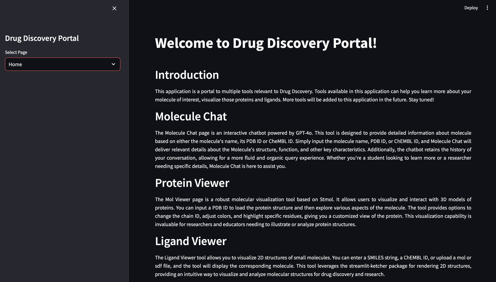

# Drug Discovery Portal: A Streamlit Web Application for Protein and lignad visualization



## Introduction

Drug discovery portal is a collection of web applications that can come handy during computational drug design process. This application is built in Streamlit and anyone can use it to visualize proteins, small molecule ligands and learn more about the protein of choice. Individual tools are developed in modules making it easier for users to run them individually or collectively as a single application. It contains three tools:

**Protein Chat:** Protein chat is a chatbot built using the OpenAI API. This tool provides responses to users' queries regarding their protein of interest and uses the information from UniProt database to do so.

**Protein Viewer:** Protein viewer tool is a visualization tool built using streamlit-molstar library. It uses the famous open source molstar library to build a streamlit based web application. Users can input either the PDB ID or upload a PDB to visualize the structures. Within the tool, users are free to modify the representations for better visualization. 

**Ligand Viewer:** Ligand Viewer tool allows you to visualize 2D structures of small molecules. You can enter a SMILES string, a ChEMBL ID, or upload a mol or sdf file, and the tool will display the corresponding molecule. This tool leverages the streamlit-ketcher package for rendering 2D structures, providing an intuitive way to visualize and analyze molecular structures for drug discovery and research.

### Pre-requisites:

### Downloading the Repository:
Clone the repository from GitHub to your local machine:

```bash
git clone https://github.com/nidhinthomas-ai/Drug_Discovery_Portal
cd Drug_Discovery_Portal-main
```

### Repository Layout:

The repository is organized as follows:
```bash
Drug_Discovery_Portal-main/  
├── main.py
├── README.md
├── assets/
│   ├── home_page.png  
│   ├── protein_chat.png
│   ├── protein_visualization.png 
│   └── ligand_visualization.png 
├── src/
│   ├── .streamlit/
│   │   └── secrets.toml
│   ├── main.py
│   ├── home_page.py
│   ├── protein_chat_page.py 
│   ├── prot_viewer_page.py
│   └── ligand_viewer_page.py
└── requirements.txt 
```

### Creating a Conda Environment:
To ensure compatibility and manage dependencies, it is recommended to create a new conda environment for this project:

```bash
conda create --name drug_discovery python=3.10
conda activate drug_discovery
```

### Install required packages:
```bash
pip install -r requirements.txt
```

### .env file:

The .env file contains the API Key:

```bash
OPENAI_API_KEY="Your_OPENAI_API_KEY"
```

**WARNING:** The API Key you create is unique to a user and a project, and must be kept private and not shared with anyone.

### To Launch the App:

```bash
cd src
streamlit run main.py
```

## Protein Chat:

The protein_chat_page.py script is designed to create an interactive web-based chatbot for retrieving and displaying detailed information about proteins. The key packages used include langchain_community.llms for integrating OpenAI's language models. The sidebar allows users to adjust the model's temperature parameter, influencing response variability. Users can input protein names or UniProt IDs, which the chatbot uses to query the UniProt and RCSB databases for relevant information. The chatbot displays the protein's primary details, including structure, function, and references, and generates detailed descriptions using the OpenAI language model. The interface is designed to maintain a conversational history, displaying both user queries and assistant responses in a chat format. The script also includes functions for fetching and formatting protein data from the respective databases, enhancing the user experience by providing comprehensive and accurate protein information.

```python
import streamlit as st
import requests
from langchain_community.llms import OpenAI as LangChainOpenAI

def fetch_protein_info_from_rcsb(pdb_id):
    url = f"https://data.rcsb.org/rest/v1/core/entry/{pdb_id}"
    response = requests.get(url)
    if response.status_code == 200:
        return response.json()
    else:
        return None

def fetch_protein_info_from_uniprot_by_name(name):
    url = f"https://rest.uniprot.org/uniprotkb/search?query={name}&format=json"
    response = requests.get(url)
    if response.status_code == 200:
        results = response.json()
        if results['results']:
            return results['results'][0]
        else:
            return None
    else:
        return None

def fetch_pdb_ids_from_uniprot(uniprot_id):
    url = f"https://rest.uniprot.org/uniprotkb/{uniprot_id}/databaseReferences?database=pdb"
    response = requests.get(url)
    if response.status_code == 200:
        results = response.json()
        pdb_ids = [entry['id'] for entry in results.get('databaseReferences', []) if entry['database'] == 'PDB']
        return pdb_ids
    else:
        return None

def format_protein_info(protein_info):
    if not protein_info:
        return "No information found.", None
    
    title = protein_info.get('struct', {}).get('title', 'N/A')
    polymer = protein_info.get('rcsb_entry_container_identifiers', {}).get('polymer_entity_count_protein', 'N/A')
    release_date = protein_info.get('rcsb_accession_info', {}).get('initial_release_date', 'N/A')
    
    details = f"**Title:** {title}\n**Polymer Entity Count (Protein):** {polymer}\n**Release Date:** {release_date}"
    return details, title

def format_protein_info_uniprot(protein_info):
    if not protein_info:
        return "No information found.", None
    
    primary_accession = protein_info.get('primaryAccession', 'N/A')
    protein_name = protein_info.get('proteinDescription', {}).get('recommendedName', {}).get('fullName', {}).get('value', 'N/A')
    organism = protein_info.get('organism', {}).get('scientificName', 'N/A')
    
    details = f"**Primary Accession:** {primary_accession}\n**Protein Name:** {protein_name}\n**Organism:** {organism}"
    return details, primary_accession

def protein_chat_page():
    st.title("Welcome to Protein Chatbot!")

    openai_api_key = st.secrets["OPENAI_API_KEY"]
    llm = LangChainOpenAI(api_key=openai_api_key, temperature=0.1, max_tokens=2048)
    
    if "openai_model" not in st.session_state:
        st.session_state["openai_model"] = llm

    if "temperature" not in st.session_state:
        st.session_state["temperature"] = 0.1 

    if "messages" not in st.session_state:
        st.session_state.messages = [
            {"role": "system", "content": """
            I am here to help you learn about your protein of interest.
            You can provide me with the name of a protein, or its UniProt ID.
            I will search the UniProt and RCSB databases for information about the protein.
            Please provide the name or ID, and I will give you detailed information about the protein, including its structure, function, and relevant references for further learning.
            """}
        ]

    for message in st.session_state.messages:
        with st.chat_message(message["role"]):
            st.markdown(message["content"])

    if prompt := st.chat_input("Enter the name of the protein or UniProt ID"):
        st.session_state.messages.append({"role": "user", "content": prompt})
        with st.chat_message("user"):
            st.markdown(prompt)

        if prompt.startswith("PDB"):
            pdb_id = prompt.split()[-1]
            protein_info = fetch_protein_info_from_rcsb(pdb_id)
            response_content, title = format_protein_info(protein_info)
        else:
            protein_info = fetch_protein_info_from_uniprot_by_name(prompt)
            if protein_info:
                response_content, primary_accession = format_protein_info_uniprot(protein_info)
                pdb_ids = fetch_pdb_ids_from_uniprot(primary_accession)
                if pdb_ids:
                    pdb_details = "\n".join(pdb_ids)
                    response_content += f"\n**PDB IDs:** {pdb_details}"
                title = primary_accession
            else:
                response_content = "No information found for the given protein name or UniProt ID."
                title = None

        if title:
            detailed_prompt = f"Provide detailed information about the protein with the following details: {response_content}. Include references."
            detailed_response = llm(detailed_prompt)
            response_content += f"\n\n{detailed_response}"

        st.session_state.messages.append({"role": "assistant", "content": response_content})
        with st.chat_message("assistant"):
            st.markdown(response_content)

    temperature = st.sidebar.slider("Temperature", min_value=0.0, max_value=1.0, value=st.session_state["temperature"], step=0.1)
    if temperature != st.session_state["temperature"]:
        st.session_state["temperature"] = temperature
        llm.temperature = temperature 

if __name__ == "__main__":
    protein_chat_page()
```

## Protein Viewer:

This script is designed to create a web interface for visualizing protein structures using Streamlit. Key packages used include streamlit for building the web application and streamlit_molstar for embedding the Mol* viewer for 3D visualization. The sidebar features a text input for PDB codes and a file uploader for .pdb files. When a PDB file is uploaded, it is temporarily stored and displayed using the Mol* viewer. If a PDB code is provided, the Mol* viewer fetches and displays the structure from the RCSB database. The main page displays the PDB code as a link to the corresponding RCSB entry and includes the 3D viewer in a designated column. 

```python
import streamlit as st
from tempfile import NamedTemporaryFile
from streamlit_molstar import st_molstar, st_molstar_rcsb

def prot_viewer_page():
    st.sidebar.title("Protein Viewer")

    pdb_code = st.sidebar.text_input(
        label="Enter PDB Code",
        value="6VN7",
    )

    st.markdown(
        f"""
        <style>
        .title-container {{
            position: fixed;
            top: 0;
            width: 100%;
            background-color: var(--background-color);
            z-index: 1000;
            padding: 40px;
        }}
        .content-container {{
            margin-top: 10px; 
        }}
        </style>
        <div class="title-container">
            <h2> PDB <a href="https://www.rcsb.org/structure/{pdb_code}" target="_blank">{pdb_code.upper()}</a></h2>
        </div>
        <div class="content-container">
        """,
        unsafe_allow_html=True
    )

    pdb_file = st.sidebar.file_uploader("Upload PDB file", type=['pdb'])

    displaycol = st.columns([1, 0.1, 250, 1])[2]

    with displaycol:
        if pdb_file:
            with NamedTemporaryFile(delete=False, suffix=".pdb") as temp_file:
                temp_file.write(pdb_file.getvalue())
                temp_file_path = temp_file.name
            st_molstar(temp_file_path, height=600)
        elif pdb_code:
            st_molstar_rcsb(pdb_code, height=600)
        else:
            st.write("Please enter a PDB code or upload a PDB file.")

    st.markdown(
        """
        <style>
        body, html {
            overflow: hidden;
        }
        .main .block-container {
            max-width: 1440px;
            padding-left: 1rem;
            padding-right: 1rem;
        }
        .css-18e3th9 {
            padding-top: 0rem;
            padding-bottom: 0rem;
            padding-left: 1rem;
            padding-right: 1rem;
        }
        .css-1d391kg {
            padding-top: 0rem;
            padding-bottom: 0rem;
            padding-left: 1rem;
            padding-right: 1rem;
        }
        .css-1lcbmhc {
            display: none;
        }
        .css-1d391kg {
            pointer-events: none;
        }
        </style>
        </div>
        """,
        unsafe_allow_html=True
    )

if __name__ == "__main__":
    prot_viewer_page()
```

## Ligand Viewer:

This tool is designed to create a web interface for viewing and editing molecular structures using Streamlit. It utilizes several key packages: streamlit_ketcher for integrating a molecule editor, and rdkit for handling chemical informatics tasks such as reading and converting molecular files. The sidebar features several input options including a text input for SMILES strings, a text input for ChEMBL IDs, and a file uploader for .mol or .sdf files. When a molecular file is uploaded, the script reads and converts it to a SMILES string using RDKit's functions. The main page displays the SMILES string of the molecule and includes an embedded Ketcher editor for visualizing and modifying the molecular structure.

```python
import streamlit as st
from streamlit_ketcher import st_ketcher
from rdkit import Chem
from rdkit.Chem import Draw
import requests
from io import BytesIO

def read_sdf_file(file):
    sdf_data = file.read().decode('utf-8')
    sdf_supplier = Chem.SDMolSupplier()
    sdf_supplier.SetData(sdf_data)
    mol = next(iter(sdf_supplier), None)
    if mol:
        smiles = Chem.MolToSmiles(mol)
        return smiles
    return None

def fetch_molecule_from_chembl(chembl_id):
    url = f'https://www.ebi.ac.uk/chembl/api/data/molecule/{chembl_id}.json'
    response = requests.get(url)
    if response.status_code == 200:
        data = response.json()
        smiles = data.get('molecule_structures', {}).get('canonical_smiles', None)
        return smiles
    return None

def ligand_viewer_page():
    st.sidebar.title("Ligand Viewer")
    DEFAULT_MOL = "CN1C=NC2=C1C(=O)N(C(=O)N2C)C"

    SMILE = st.sidebar.text_input("Enter SMILES string", DEFAULT_MOL)
    chembl_id = st.sidebar.text_input("Enter ChEMBL ID")
    mol_file = st.sidebar.file_uploader("Upload mol or sdf file", type=['mol', 'sdf'])

    smiles = SMILE

    if mol_file:
        if mol_file.name.endswith('.mol'):
            mol = Chem.MolFromMolFile(mol_file)
            if mol:
                smiles = Chem.MolToSmiles(mol)
            else:
                st.sidebar.error("Invalid mol file.")
        elif mol_file.name.endswith('.sdf'):
            sdf_smiles = read_sdf_file(mol_file)
            if sdf_smiles:
                smiles = sdf_smiles
            else:
                st.sidebar.error("Invalid sdf file.")

    elif chembl_id:
        fetched_smiles = fetch_molecule_from_chembl(chembl_id)
        if fetched_smiles:
            smiles = fetched_smiles
        else:
            st.sidebar.error("Invalid ChEMBL ID or unable to fetch molecule.")
    else:
        smiles = SMILE

    st.markdown(
        f"""
        <style>
        .title-container {{
            position: fixed;
            top: 0;
            width: 100%;
            background-color: var(--background-color);
            z-index: 1000;
            padding: 40px;
        }}
        .content-container {{
            margin-top: 10px; 
        }}
        </style>
        <div class="title-container">
            <h2> Molecule SMILES: {smiles}</h2>
        </div>
        <div class="content-container">
        """,
        unsafe_allow_html=True
    )

    # Set the desired width and height for the visualization
    page_width = 1440 
    height = 600

    col1, spacer, col2, col3 = st.columns([1, 0.1, 250, 1])

    with col2:
        smile_code = st_ketcher(smiles, height=height)

    st.markdown(
        """
        <style>
        body, html {
            overflow: hidden;
        }
        .main .block-container {
            max-width: 1440px;
            padding-left: 1rem;
            padding-right: 1rem;
        }
        .css-18e3th9 {
            padding-top: 0rem;
            padding-bottom: 0rem;
            padding-left: 1rem;
            padding-right: 1rem;
        }
        .css-1d391kg {
            padding-top: 0rem;
            padding-bottom: 0rem;
            padding-left: 1rem;
            padding-right: 1rem;
        }
        .css-1lcbmhc {
            display: none;
        }
        .css-1d391kg {
            pointer-events: none;
        }
        </style>
        </div>
        """,
        unsafe_allow_html=True
    )
```

